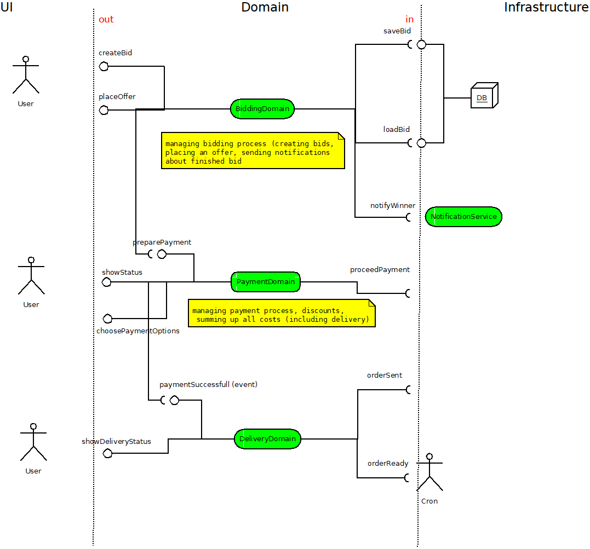

This is going to be kind of a copy of my previous project **buy-it** (which is not finished yet) but with different approach.
First of all I don't want to implement any database connection, everything is going to be done in-memory.
Facade is going to be entrypoint for any other domains.
Exemplary diagram with planned domains and its dependencies soon. This project will involve some of DDD principles based on Eric Evans' DDD book.

Here's simplified diagram of the workflow. I'll try to keep it upgraded

